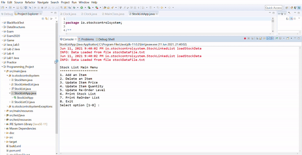

[![LinkedIn][linkedin-shield]][linkedin-url]

 

  <h3 align="center">StockList</h3>

  

   A programme that keeps track of stock in this imaginary store.
     
  

<!-- TABLE OF CONTENTS -->

  
Table of Contents

  <ol>
    <li>
      <a href="#about-the-project">About The Project</a>
      <ul>
        <li><a href="#built-with">Built With</a></li>
      </ul>
    </li>
    <li><a href="#contact">Contact</a></li>
  </ol>

<!-- ABOUT THE PROJECT -->
## About The Project
This was a first year final assignment. The aim was to create a stocklist admin system in Java using OOP principles. I also went ahead to implement testing, exception handling and logging.

#### StockLinkedList failed test

#### StockLinkedList passed test

#### StockItem passed test

#### Reorder Level and stockList

#### Exceptions

### Built With

Built with Java

<!-- CONTACT -->
## Contact

Linda Scoon - [@linda_scoon](https://twitter.com/linda_scoon) - Twitter

<!-- MARKDOWN LINKS & IMAGES --> 
[linkedin-shield]: https://img.shields.io/badge/-LinkedIn-black.svg?style=for-the-badge&logo=linkedin&colorB=555
[linkedin-url]: https://www.linkedin.com/in/linda-scoon/
